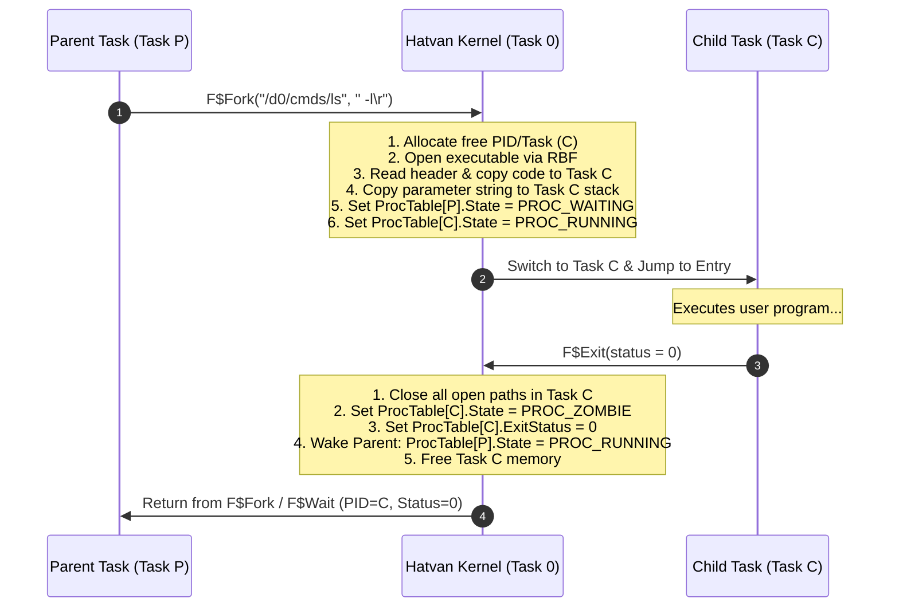

# Hatvan OS Kernel Architecture & Implementation Plan in MiniGolf

**Target Systems**: Motorola 6809 / Hitachi 6309 (**gep9**, formerly Hatvan VM) & Motorola 68000 (**gepk**, formerly Hatvan VM/K)  
**Document**: `doc/hatvan-kernel-plan.md`  
**Implementation Language**: **MiniGolf** (`github.com/strickyak/minigolf`)  
**Status**: Approved Architecture & MiniGolf Implementation Specification

---

## 1. Executive Summary & Design Vision

**Hatvan OS** is a lean, robust, multi-tasking operating system designed to run across both 8-bit/16-bit systems (Motorola 6809 / Hitachi 6309 on `gep9`) and 16-bit/32-bit systems (Motorola 68000 on `gepk`). (*Hatvan is a city in Hungary; "gép" means "machine" in Hungarian, corresponding to kernel `ARCH` constants `'9'` and `'k'`.*)

The kernel is authored in **MiniGolf**, a statically typed systems programming language with Go syntax and C99-style bare-metal semantics, developed specifically for memory-constrained and retro-computing architectures. Through MiniGolf's whole-program compilation and target-adaptive type system (`word` = 16-bit on 6809, 32-bit on 68000), a single machine-independent kernel codebase runs identically on both machines.

### Key Architectural Pillars:
- **Dedicated Task 0 Kernel**: The operating system kernel resides exclusively in **Task 0**, mapped at boot before any user tasks are scheduled.
- **Isolated User Tasks (Tasks 1..255)**: Each user process executes in an isolated address space where its Process ID (PID) matches its hardware Task ID (`1..255`).
- **Hardware I/O, Zero Hypercalls**: All console I/O, logging, disk block transfers, timer ticks, and cross-task copies strictly use memory-mapped I/O registers. Emulated hypercalls are bypassed entirely, guaranteeing identical behavior across both software virtual machines and physical hardware implementations.
- **Synchronous Process Execution**: To eliminate complex scheduler queues and async race conditions in the initial system, process execution follows a synchronous fork/wait model: a parent process is suspended while its child executes, and `F$Wait` reaps the child exit status immediately.
- **Zero-Heap, Fixed-Memory Architecture**: No heap, dynamic allocators (`malloc`), or garbage collection are used in the kernel. All data structures (`ProcTable`, `PathTable`, `DevTable`, sector cache) are statically allocated arrays of structs.
- **Dual Working Directories per Process (`cwd` and `cxd`)**: Every process tracks two independent working directories: `cwd` (Current Working Directory for data files and relative paths) and `cxd` (Current Execution Directory for finding command binaries). Standard OS-9 system calls set and query both directories.
- **Dual Executable Binary Formats in `cxd`**: Command binaries located in `cxd` can be either standard **OS-9 machine language modules** (with `$87 $CD` module headers) or **DECB binaries** (Disk Extended Color Basic segmented binaries). The loader automatically identifies the binary type and sets up the user task memory space accordingly.

```
+-------------------------------------------------------------------------+
|                        Hatvan OS Kernel (Task 0)                        |
+-------------------------------------------------------------------------+
| kernel/common/                                                          |
| - main.golf            : Kernel initialization, banner, root shell      |
| - syscall.golf         : OS-9 syscall dispatcher (I$Open, F$Fork...)   |
| - proc.golf            : ProcTable[32] & synchronous lifecycle          |
| - path.golf            : PathTable[32] & stream I/O                     |
| - rbf.golf             : OS-9 RBF Filesystem (LSN 0, FDs, Dirs)         |
| - dev.golf             : DevTable & /term, /d0..3, /log, /null drivers  |
| - prelude.golf         : Dedicated kernel prelude (MMIO, peek/poke)     |
+------------------------------------+------------------------------------+
| kernel/klib/ (General Library)     | Low-Level Platform HAL             |
| - klib.golf: memset, memcpy,       | - kernel/m6809/hal.golf ($FF00)    |
|   memeq, strlen, streq, fmt        | - kernel/m68k/hal.golf  ($00FF0000)|
+------------------------------------+------------------------------------+
| Hardware / Virtual Machine Layer                                        |
| - gep9        (6809 / 6309, '9')   | - gepk        (M68000, 'k')        |
+------------------------------------+------------------------------------+
```

---

## 2. Directory Structure & MiniGolf Multi-Target Compilation

The kernel source tree is organized into four distinct directories:

```
kernel/
├── common/             # Machine-neutral kernel core & dedicated prelude
│   ├── main.golf       # Kernel entry point, banner, and bootstrap
│   ├── prelude.golf    # Dedicated kernel prelude (MMIO, memory primitives)
│   ├── proc.golf       # Process table and lifecycle management
│   ├── path.golf       # Open path descriptors and file table
│   ├── dev.golf        # Device driver registration and dispatch table
│   ├── rbf.golf        # OS-9 Random Block File (RBF) filesystem driver
│   ├── syscall.golf    # NitrOS-9 system call dispatcher
│   └── sh.golf         # Minimal resident command shell
├── klib/               # Reusable general library routines (kernel & userland)
│   └── klib.golf       # Memory, string, and formatting utilities
├── m6809/              # Motorola 6809 / Hitachi 6309 HAL
│   ├── hal.golf        # 6809 hardware register equates and driver routines
│   └── trap_m6809.asm  # SWI2 entry stub, vector table, and stack switcher
└── m68k/               # Motorola 68000 HAL
    ├── hal.golf        # 68000 hardware register equates and driver routines
    └── trap_m68k.s     # TRAP #0 handler, exception vectors, and RTE glue
```

### 2.1 Platform Selection via MiniGolf `-I` Include Flags

MiniGolf utilizes a **Whole-Program Compilation** model. Instead of compiling separate object files and linking them with an external linker, `minigolf` parses all imported source files at once, applies dead-code and dead-branch elimination, and generates a unified assembly file.

The compiler resolves `import "hal"` by searching the directories specified by `-I` flags in left-to-right order:

#### Target A: Motorola 6809 (`gep9`)
```bash
minigolf -m M6809 \
    -I kernel/m6809 \
    -I kernel/common \
    -I kernel/klib \
    -o _tmp/kernel_6809.asm \
    kernel/common/main.golf
```
- By placing `-I kernel/m6809` first, `import "hal"` automatically binds to `kernel/m6809/hal.golf` (`ARCH = '9'`).
- `word` resolves to a 16-bit unsigned integer (`WordSize = 2`).
- The backend outputs clean Motorola 6809 assembly code assembled with `lwasm`.

#### Target B: Motorola 68000 (`gepk`)
```bash
minigolf -m=k \
    -I kernel/m68k \
    -I kernel/common \
    -I kernel/klib \
    -o _tmp/kernel_68k.s \
    kernel/common/main.golf
```
- By placing `-I kernel/m68k` first, `import "hal"` automatically binds to `kernel/m68k/hal.golf` (`ARCH = 'k'`).
- `word` resolves to a 32-bit unsigned integer (`WordSize = 4`).
- The backend outputs Motorola 68000 assembly code assembled with `asm68k`.

---

## 3. General Library: `kernel/klib/`

The `kernel/klib/` directory contains machine-neutral, re-entrant utility routines that have **zero dependency on kernel globals or system calls**. These routines can be compiled directly into the kernel or imported into user-mode programs.

### 3.1 Implemented Primitives (`kernel/klib/klib.golf`)

```go
package klib

// memset fills n bytes at ptr with value b.
func memset(ptr *byte, b byte, n word) {
	addr := word(ptr)
	for i := word(0); i < n; i++ {
		pokeb(addr+i, b)
	}
}

// memcpy copies n bytes from src to dst.
func memcpy(dst *byte, src *byte, n word) {
	d := word(dst)
	s := word(src)
	for i := word(0); i < n; i++ {
		pokeb(d+i, peekb(s+i))
	}
}

// memeq returns true if n bytes of a and b are identical.
func memeq(a *byte, b *byte, n word) bool {
	p1 := word(a)
	p2 := word(b)
	for i := word(0); i < n; i++ {
		if peekb(p1+i) != peekb(p2+i) {
			return false
		}
	}
	return true
}

// strlen returns the length of a null-terminated string.
func strlen(s *byte) word {
	n := word(0)
	p := word(s)
	for peekb(p+n) != 0 {
		n++
	}
	return n
}

// streq returns true if null-terminated strings a and b are identical.
func streq(a *byte, b *byte) bool {
	p1 := word(a)
	p2 := word(b)
	for {
		c1 := peekb(p1)
		c2 := peekb(p2)
		if c1 != c2 {
			return false
		}
		if c1 == 0 {
			return true
		}
		p1++
		p2++
	}
}
```

---

## 4. Dedicated Kernel Prelude (`kernel/common/prelude.golf`)

The kernel maintains its own tailored copy of `prelude.golf` in `kernel/common/prelude.golf`. The standard language prelude assumes a userland environment; the kernel prelude strips out dynamic heap allocation and provides hardware-level primitives:

### 4.1 Memory Access & Volatile MMIO Registers
When interacting with memory-mapped I/O ports (such as UARTs and DMA controllers), the compiler's optimizer must never coalesce, eliminate, or reorder memory accesses.

The kernel prelude provides explicit `volatile` intrinsics using the `// golf:volatile` pragma:
```go
package prelude

// Standard unchecked memory peeks and pokes
func peekb(addr word) byte        { return *((*byte)(addr)) }
func peekw(addr word) word        { return *((*word)(addr)) }
func pokeb(addr word, value byte) { *((*byte)(addr)) = value }
func pokew(addr word, value word) { *((*word)(addr)) = value }

// Volatile memory-mapped I/O access (guarantees real load/store instructions)
// golf:volatile
func vpeekb(addr word) byte { return *((*byte)(addr)) }

// golf:volatile
func vpeekw(addr word) word { return *((*word)(addr)) }

// golf:volatile
func vpokeb(addr word, value byte) { *((*byte)(addr)) = value }

// golf:volatile
func vpokew(addr word, value word) { *((*word)(addr)) = value }

// Pointer arithmetic helpers
func pointer_add[T any](ptr *T, i int) *T {
	return (*T)(word(ptr) + word(i)*sizeof[T]())
}
func pointer_sub[T any](ptr *T, i int) *T {
	return (*T)(word(ptr) - word(i)*sizeof[T]())
}
```

---

## 5. MiniGolf Systems Programming Idioms in Hatvan OS

Developing an operating system in MiniGolf adheres to several core idioms:

1. **Target-Adaptive Word Size**:
   - `word` is native pointer-size: **16-bit** on M6809 (`WordSize = 2`), **32-bit** on M68000 (`WordSize = 4`).
   - Pointers (`*T`) can be cast to `word` via `word(ptr)` and back via `(*T)(addr)` without portability penalties.
   - 32-bit values required on M6809 (e.g. 24-bit/32-bit disk LSNs or file sizes) are handled via pairs of words or struct fields.
2. **Zero-Heap, Fixed-Memory Architecture**:
   - MiniGolf structs and arrays are value types.
   - The kernel pre-allocates all process tables (`[32]Process`), path tables (`[32]PathDesc`), and sector buffers (`[4][256]byte`) as static global variables.
   - Completely eliminates out-of-memory crashes, heap fragmentation, and garbage collection latency.
3. **No Go `const (...)` Blocks**:
   - In MiniGolf, constants must be declared individually: `const NAME = value`.
4. **Direct Function Pointers**:
   - MiniGolf supports function pointer types: `func(pd *PathDesc, path *byte, mode byte) byte`.
   - Used for static device driver dispatch tables.

---

## 6. Hardware Abstraction Layer (HAL)

All hardware communication is isolated behind the `hal` package, implemented specifically for each platform in `kernel/m6809/hal.golf` and `kernel/m68k/hal.golf`.

### 6.1 Hardware Register Equates

| Register | 6809 Port | 68000 Port | 6809 Type | 68000 Type | Description |
| :--- | :--- | :--- | :--- | :--- | :--- |
| `Term.Out` | `$FF00` | `$00FF0000` | Byte | Byte | Console character output to stdout |
| `Term.In` | `$FF01` | `$00FF0002` | Byte | Byte | Console character input (0 = empty) |
| `Reg.Stat` | `$FF02` | `$00FF0004` | Word | Word | Status (Bit 0: Timer, Bit 1: RxReady) |
| `Reg.Ctrl` | `$FF03` | `$00FF0006` | Word | Word | Control (Bit 0: TimerIRQ, Bit 1: RxIRQ) |
| `logchar` | `$FF04` | `$00FF0008` | Byte | Byte | Debug character output to stderr |
| `Exit.Code`| `$FF05` | `$00FF000A` | Byte | Byte | Halts VM with exit code |
| `Disk.Drive`| `$FF10`| `$00FF0010` | Byte | Byte | Target disk drive (0..3) |
| `Disk.Sector`| `$FF11..$FF13`| `$00FF0014` | 3 bytes | 32-bit Word | Logical Sector Number (LSN) |
| `Disk.Task` | `$FF14` | `$00FF0018` | Byte | Byte | Target memory task ID (0..255) |
| `Disk.Addr` | `$FF15..$FF16`| `$00FF001A` | 16-bit Word | 32-bit Word | Memory buffer address |
| `Disk.CmdSt`| `$FF17` | `$00FF001E` | Byte | Byte | 1=Read, 2=Write; Read status: 0=Busy, 1=OK |
| `Task.Active`| `$FF20` (Fuse)| `$00FF0020` (Reg)| Byte | Byte | Active user task selector |
| `DMA.SrcTask`| `$FF21`| `$00FF0022` | Byte | Byte | DMA source task ID |
| `DMA.SrcAddr`| `$FF22..$FF23`| `$00FF0024` | 16-bit Word | 32-bit Word | DMA source address |
| `DMA.DstTask`| `$FF24`| `$00FF0028` | Byte | Byte | DMA destination task ID |
| `DMA.DstAddr`| `$FF25..$FF26`| `$00FF002A` | 16-bit Word | 32-bit Word | DMA destination address |
| `DMA.Count` | `$FF27`| `$00FF002E` | 8-bit | 32-bit Word | Byte count to transfer |
| `DMA.CmdSt` | `$FF27` (Status)| `$00FF0032` (CmdSt)| Byte | Byte | Trigger DMA copy / Status |

### 6.2 6809 HAL Implementation (`kernel/m6809/hal.golf`)

```go
package hal

const ARCH = '9'

const PORT_TERMOUT   = 0xFF00
const PORT_TERMIN    = 0xFF01
const PORT_REGSTAT   = 0xFF02
const PORT_REGCTRL   = 0xFF03
const PORT_LOGCHAR   = 0xFF04
const PORT_EXIT      = 0xFF05

const PORT_DISKDRV   = 0xFF10
const PORT_DISKSEC0  = 0xFF11
const PORT_DISKSEC1  = 0xFF12
const PORT_DISKSEC2  = 0xFF13
const PORT_DISKTASK  = 0xFF14
const PORT_DISKADDR  = 0xFF15
const PORT_DISKCMD   = 0xFF17

const PORT_TASKFUSE  = 0xFF20

const PORT_DMASRCTASK = 0xFF21
const PORT_DMASRCADDR = 0xFF22
const PORT_DMADSTTASK = 0xFF24
const PORT_DMADSTADDR = 0xFF25
const PORT_DMACNT     = 0xFF27

func PutChar(b byte) { vpokeb(PORT_TERMOUT, b) }
func GetChar() byte  { return vpeekb(PORT_TERMIN) }
func LogChar(b byte) { vpokeb(PORT_LOGCHAR, b) }

func Exit(code byte) {
	vpokeb(PORT_EXIT, code)
	for {}
}

func DiskTransfer(drive byte, lsn word, task byte, addr word, isWrite byte) byte {
	vpokeb(PORT_DISKDRV, drive)
	vpokeb(PORT_DISKSEC0, 0)
	vpokeb(PORT_DISKSEC1, byte(lsn>>8))
	vpokeb(PORT_DISKSEC2, byte(lsn))
	vpokeb(PORT_DISKTASK, task)
	vpokew(PORT_DISKADDR, addr)

	cmd := byte(1) // 1 = Read
	if isWrite != 0 {
		cmd = 2 // 2 = Write
	}
	vpokeb(PORT_DISKCMD, cmd)

	for {
		st := vpeekb(PORT_DISKCMD)
		if st > 0 {
			return st
		}
	}
}

func DMACopy(srcTask byte, srcAddr word, dstTask byte, dstAddr word, count word) {
	for count > 0 {
		chunk := count
		if chunk > 256 {
			chunk = 256
		}
		vpokeb(PORT_DMASRCTASK, srcTask)
		vpokew(PORT_DMASRCADDR, srcAddr)
		vpokeb(PORT_DMADSTTASK, dstTask)
		vpokew(PORT_DMADSTADDR, dstAddr)

		cntByte := byte(chunk)
		if chunk == 256 {
			cntByte = 0
		}
		vpokeb(PORT_DMACNT, cntByte)

		for vpeekb(PORT_DMACNT) == 0 {}

		count -= chunk
		srcAddr += chunk
		dstAddr += chunk
	}
}

func SwitchTask(task byte) {
	vpokeb(PORT_TASKFUSE, task)
}
```

### 6.3 68000 HAL Implementation (`kernel/m68k/hal.golf`)

```go
package hal

const ARCH = 'k'

const PORT_TERMOUT   = 0x00FF0000
const PORT_TERMIN    = 0x00FF0002
const PORT_REGSTAT   = 0x00FF0004
const PORT_REGCTRL   = 0x00FF0006
const PORT_LOGCHAR   = 0x00FF0008
const PORT_EXIT      = 0x00FF000A

const PORT_DISKDRV   = 0x00FF0010
const PORT_DISKSEC   = 0x00FF0014 // 32-bit LSN
const PORT_DISKTASK  = 0x00FF0018
const PORT_DISKADDR  = 0x00FF001A // 32-bit Address
const PORT_DISKCMD   = 0x00FF001E

const PORT_TASKREG   = 0x00FF0020

const PORT_DMASRCTASK = 0x00FF0022
const PORT_DMASRCADDR = 0x00FF0024 // 32-bit Address
const PORT_DMADSTTASK = 0x00FF0028
const PORT_DMADSTADDR = 0x00FF002A // 32-bit Address
const PORT_DMACNT     = 0x00FF002E // 32-bit Count
const PORT_DMACMD     = 0x00FF0032

func PutChar(b byte) { vpokeb(PORT_TERMOUT, b) }
func GetChar() byte  { return vpeekb(PORT_TERMIN) }
func LogChar(b byte) { vpokeb(PORT_LOGCHAR, b) }

func Exit(code byte) {
	vpokeb(PORT_EXIT, code)
	for {}
}

func DiskTransfer(drive byte, lsn word, task byte, addr word, isWrite byte) byte {
	vpokeb(PORT_DISKDRV, drive)
	vpokew(PORT_DISKSEC, lsn)
	vpokeb(PORT_DISKTASK, task)
	vpokew(PORT_DISKADDR, addr)

	cmd := byte(1) // 1 = Read
	if isWrite != 0 {
		cmd = 2 // 2 = Write
	}
	vpokeb(PORT_DISKCMD, cmd)

	for {
		st := vpeekb(PORT_DISKCMD)
		if st > 0 {
			return st
		}
	}
}

func DMACopy(srcTask byte, srcAddr word, dstTask byte, dstAddr word, count word) {
	vpokeb(PORT_DMASRCTASK, srcTask)
	vpokew(PORT_DMASRCADDR, srcAddr)
	vpokeb(PORT_DMADSTTASK, dstTask)
	vpokew(PORT_DMADSTADDR, dstAddr)
	vpokew(PORT_DMACNT, count)
	vpokeb(PORT_DMACMD, 1)

	for vpeekb(PORT_DMACMD) == 0 {}
}

func SwitchTask(task byte) {
	vpokeb(PORT_TASKREG, task)
}
```

---

## 7. MiniGolf Kernel Data Structures

All multi-byte fields are stored in **big-endian** order.

### 7.1 Process Table (`ProcTable`)

The kernel maintains a static array of process entries:

```go
const PROC_FREE    = 0 // Slot available
const PROC_RUNNING = 1 // Currently executing process
const PROC_WAITING = 2 // Suspended waiting for child process
const PROC_ZOMBIE  = 3 // Terminated, waiting for parent F$Wait

type Process struct {
	PID         byte     // Process ID (1..31, matches Task ID)
	State       byte     // PROC_FREE, PROC_RUNNING, etc.
	ParentPID   byte     // PID of parent process
	TaskID      byte     // Hardware Task ID (matches PID)
	ExitStatus  word     // Exit code returned on F$Exit
	SavedSP     word     // Saved user stack pointer
	Paths       [16]byte // Path table indices (0xFF = closed)
	CwdFDLSN    word     // Current Working Directory (cwd) FD sector LSN (data directory)
	CxdFDLSN    word     // Current Execution Directory (cxd) FD sector LSN (command directory)
	LineMode    byte     // 0 = '\n' (Unix), 1 = '\r' (OS-9)
	CodeStart   word     // User code load address
	CodeSize    word     // User code size in bytes
	DataTop     word     // User data top
	StackBottom word     // Lowest allowed user stack boundary
}

const MAX_PROCS = 32
var ProcTable [MAX_PROCS]Process
var CurrentPID byte
```

#### 7.1.1 Process Working Directories (`cwd` and `cxd`)

In accordance with OS-9 architecture, each process maintains two distinct, independent working directory references stored as the physical sector LSN of the corresponding directory's File Descriptor (FD):

1. **`cwd` (Current Working Directory / Data Directory)**:
   - Used for all standard data file operations.
   - Any relative pathname without a leading slash (`/`) supplied to `I$Open`, `I$Create`, or `I$Delete` (with mode bit `EXEC.` cleared) is resolved starting from `cwd`.
2. **`cxd` (Current Execution Directory / Command Directory)**:
   - Used specifically for command binary lookup.
   - When a command is invoked via `F$Fork`, `F$Chain`, or the interactive shell without a path slash (e.g. `ls`, `cat`, `asm`, `basic09`), the kernel searches `cxd` to find the executable binary.
   - Any file system call with the `EXEC.` mode flag asserted (`mode & 0x04 != 0`) resolves relative paths starting from `cxd`.

**Lifecycle & Inheritance**:
- **Boot Defaults**: At machine startup, the root Task 1 process (interactive shell) initializes `cwd` to the root directory of the boot drive (`/d0`, obtained from LSN 0 Superblock `DD.DIR`) and `cxd` to the execution directory (`/d0/cmds`).
- **Process Forking**: When a child process is spawned via `F$Fork`, it automatically inherits both `cwd` (`CwdFDLSN`) and `cxd` (`CxdFDLSN`) from its parent process.
- **Dynamic Updates**: A process may independently change either directory at runtime via the `I$ChgDir` system call.

#### 7.1.2 Standard Paths Inheritance (Paths 0, 1, 2, 3)

In standard OS-9, three file descriptors are inherited (duplicated) across fork: `0` (stdin), `1` (stdout), and `2` (stderr). In Hatvan OS, **four standard paths (0, 1, 2, 3) are inherited**:
1. **Path 0 (`stdin`)**: Standard input (usually `/term` in read mode).
2. **Path 1 (`stdout`)**: Standard output (usually `/term` in write mode).
3. **Path 2 (`stderr`)**: Standard error (usually `/term` in write mode).
4. **Path 3 (`stdlog`)**: Standard diagnostic logger (connected to `/log`, port `$FF04`).

**Inheritance Rules during `SysFork`**:
- For each path index `p` from `0` to `3`:
  - If parent's `Paths[p] != 0xFF`, the descriptor in `PathTable[parent.Paths[p]]` has its `RefCount` incremented by 1, and the child's `Paths[p]` is set to `parent.Paths[p]`.
  - If parent's `Paths[p] == 0xFF`, child's `Paths[p]` is set to `0xFF`.
- All other paths (`4..15`) in the child process are initialized to closed (`0xFF`).


### 7.2 Open Path / File Table (`PathTable`)

A centralized global table representing all active file and device streams:

```go
const DEV_TERM = 0 // Console terminal (/term)
const DEV_DISK = 1 // RBF Disk volume (/d0 .. /d3)
const DEV_LOG  = 2 // Diagnostic log (/log)
const DEV_NULL = 3 // Null device (/null)

const MODE_READ  = 1
const MODE_WRITE = 2
const MODE_DIR   = 4

type PathDesc struct {
	RefCount  byte      // Number of active references (0 = free)
	DevType   byte      // DEV_TERM, DEV_DISK, etc.
	Drive     byte      // Drive index (0..3) if DEV_DISK
	Mode      byte      // Access mode flags
	FilePos   word      // Current file byte position
	FileSize  word      // Total file size from File Descriptor
	FDLSN     word      // Physical LSN of File Descriptor sector
	FDDirty   byte      // 1 if FD attributes/size need flushing
	BufLSN    word      // LSN currently cached in SectorBuf
	BufDirty  byte      // 1 if SectorBuf has pending writes
	SectorBuf [256]byte // 256-byte sector buffer
}

const MAX_PATHS = 32
var PathTable [MAX_PATHS]PathDesc
```

### 7.3 Device Table & Driver Interfaces (`DevTable`)

A static dispatch table mapping device types to driver implementations:

```go
type DeviceDriver struct {
	Name  *byte
	Open  func(pd *PathDesc, path *byte, mode byte) byte
	Read  func(pd *PathDesc, task byte, userBuf *byte, count word) word
	Write func(pd *PathDesc, task byte, userBuf *byte, count word) word
	Seek  func(pd *PathDesc, offset word) byte
	Close func(pd *PathDesc)
}

const NUM_DEVICES = 4
var DevTable [NUM_DEVICES]DeviceDriver
```

### 7.4 RBF Filesystem Structures

#### Identification Sector (LSN 0 Superblock)
```go
type RBFSuperblock struct {
	TotalSectors0 byte     // 24-bit total sectors: MSB
	TotalSectors1 byte     // middle byte
	TotalSectors2 byte     // LSB
	TrackSize     byte     // Track size in sectors (DD.TKS)
	MapBytes      word     // Allocation bitmap size in bytes (DD.MAP)
	ClusterSize   word     // Sectors per cluster (DD.BIT)
	RootDirLSN0   byte     // 24-bit Root Dir FD LSN: MSB
	RootDirLSN1   byte     // middle byte
	RootDirLSN2   byte     // LSB
	OwnerID       word     // Owner ID (DD.OWN)
	Attributes    byte     // Disk attributes (DD.ATT)
	DiskID        word     // Disk ID (DD.DSK)
	Date          [5]byte  // Creation date (DD.DAT)
	VolumeName    [32]byte // Volume name string (high-bit terminated)
}
```

#### File Descriptor Sector (FD)
```go
type RBFSegment struct {
	LSN0  byte // 24-bit starting sector LSN (MSB)
	LSN1  byte // middle byte
	LSN2  byte // LSB
	Count word // Contiguous sector count (16-bit)
}

type RBFFileDescriptor struct {
	Attributes byte          // FD.ATT: $80 = Directory, $01 = Read, $02 = Write
	OwnerID    word          // FD.OWN
	ModDate    [5]byte       // FD.DAT
	LinkCount  byte          // FD.LNK
	FileSize   word          // FD.SIZ: 32-bit on M68k; high/low words on 6809
	CreateDate [3]byte       // FD.CRE
	Segments   [48]RBFSegment// Allocation segments ($10..$FF)
}
```

#### Directory Entry Record (32 bytes)
```go
type RBFDirEntry struct {
	Name  [29]byte // Filename string (last character has bit 7 set)
	FDLSN0 byte    // 24-bit File Descriptor LSN (MSB)
	FDLSN1 byte    // middle byte
	FDLSN2 byte    // LSB
}
```

### 7.5 Supported Command Binary Formats in `cxd`

When a command is executed (via `F$Fork`, `F$Chain`, or the interactive shell), the kernel resolves the command binary name against `cxd` (if given as a relative name) or from the specified absolute path. Hatvan OS natively supports two distinct executable binary formats:

#### 1. OS-9 Machine Language Modules (`Prgrm = $10`)
Standard NitrOS-9 / OS-9 relocatable or position-independent binary modules:
- **Header Structure**:
  - `$00..$01`: Sync bytes `$87 $CD` (OS-9 Module Magic ID).
  - `$02..$03`: Total module size in bytes (big-endian 16-bit).
  - `$04..$05`: Offset to module name string.
  - `$06`: Module type and language byte (`$11` for 6809 Machine Language Program, `$12` for 6309 Program).
  - `$07`: Attributes and revision level (`$81` = Re-entrant, Rev 1).
  - `$08`: Header parity check byte (`$FF ^ sum of bytes $00..$07`).
  - `$09..$0A`: Execution entry point offset relative to module start.
  - `$0B..$0C`: Permanent data storage requirement in bytes (BSS / data size).
- **Module Trailer**:
  - Final 3 bytes contain the 24-bit OS-9 CRC polynomial checksum.
- **Task Loader Initialization**:
  - The module's read-only code/data is transferred via DMA into the user task address space starting at `$0000` (or the program base).
  - User stack `S` is initialized to the top of allocated memory (`$FE00`), with command-line parameter strings marshalled onto the stack.
  - Register `DP` (Direct Page) and `U` (Data Pointer) are initialized to the allocated data storage block.
  - Initial `PC` is set to `CodeStart + ExecutionOffset`.

#### 2. DECB Binary Format (Disk Extended Color Basic)
Segmented machine language binaries generated by standard cross-assemblers (such as `lwasm --decb`):
- **Segment Structure**:
  - **Preamble Byte**: `$00` flags an incoming data chunk.
  - **Chunk Length**: 2-byte word specifying segment length $N$.
  - **Load Address**: 2-byte word specifying destination address in the user task.
  - **Payload**: Exactly $N$ bytes copied into user task RAM via DMA.
  - *(Multiple preamble chunks may appear sequentially for non-contiguous programs).*
- **Postamble**:
  - **Preamble Byte**: `$FF` terminates the segment list.
  - **Zero Word**: `$00 $00` (length 0).
  - **Execution Address**: 2-byte word specifying the initial program counter `PC`.
- **32-Bit Paging & Page Spilling (M68000)**:
  - Headers remain strictly 5 bytes long. A `SET_HIGH16_ADDR32 = 254` (`$FE`) header sets the persistent upper 16 bits of target addresses (starts at `$0000`).
  - A `$00` data chunk is allowed to spill across a 64 KB page boundary if `Load Address + Chunk Length > $10000`; spilling into the next page does not alter the remembered `High16` value.
- **Task Loader Initialization**:
  - Each chunk is loaded directly to its designated physical address inside the child's task space.
  - User stack `S` is initialized to `$FE00` (with marshalled arguments).
  - Initial `PC` is set to the postamble execution address.

#### 3. Automatic Binary Format Detection
The loader reads the initial bytes of the file to determine the format:
- If first two bytes are `$87 $CD`: Load as **OS-9 Module**.
- If first byte is `$00`: Load as **DECB Segmented Binary**.
- Otherwise: Return error `E$Format` (`$D3` / Invalid module header).


---

## 8. Trap Entry, System Call Dispatch & Register Marshalling

System call interception is implemented in thin assembly wrappers that interface with the MiniGolf function `SyscallDispatch`.

### 8.1 6809 Trap Protocol (`kernel/m6809/trap_m6809.asm`)
1. User invokes `SWI2` followed by an inline opcode byte: `fcb <call_num>`.
2. Hardware pushes `PC, U, Y, X, DP, B, A, CC` to the user stack in Task $N$.
3. The VM switches memory to Task 0 during vector fetch and jumps to `$FFF2`.
4. The assembly stub:
   - Reads the user's saved `PC` via DMA from the user stack.
   - Reads the inline `<call_num>` byte, increments saved `PC`, and saves registers into a Task 0 parameter block.
   - Calls `SyscallDispatch(callNum, regA, regB, regX, regY, regU)`.
   - Writes updated return values back to the user stack via DMA.
   - Writes target PID to `TaskFuse` (`$FF20`).
   - Executes `RTI`. The VM automatically arms the user task on the instruction following `RTI`.

### 8.2 68000 Trap Protocol (`kernel/m68k/trap_m68k.s`)
1. User loads syscall opcode into `D0` and executes `TRAP #0`.
2. Hardware enters Supervisor mode (`SR[S]=1`), asserting `FC2=1` (Task 0 Supervisor space), and pushes user `PC` and `SR` onto `SSP`.
3. The assembly stub:
   - Pushes user data and address registers `D0-D7 / A0-A6` onto `SSP`.
   - Reads `USP` into `ProcTable[CurrentPID].SavedSP`.
   - Calls `SyscallDispatch(d0, d1, a0, a1, a2)`.
   - Stores return values into the saved `D0` / `D1` / `CCR` stack frame.
   - Writes target PID to `TaskReg` (`$00FF0020`).
   - Restores user registers and executes `RTE`.

### 8.3 Supported NitrOS-9 System Call Subset

| Code | Call | MiniGolf Handler | Parameters | Return Values |
| :---: | :--- | :--- | :--- | :--- |
| `$84` | `I$Open` | `SysOpen(path *byte, mode byte)` | Path string, mode (`READ.`, `WRITE.`, `DIR.`, `EXEC.`) | Path ID (`A`), Error (`B`) |
| `$85` | `I$Create` | `SysCreate(path *byte, mode byte)` | Path string, mode, attrs | Path ID (`A`), Error (`B`) |
| `$86` | `I$ChgDir` | `SysChgDir(path *byte, mode byte)` | Path string (`X`), mode (`A`: `READ.`=cwd, `EXEC.`=cxd) | Success (`CC.C`=0), Error (`B`) |
| `$87` | `I$Delete` | `SysDelete(path *byte)` | Path string (`X`) | Error (`B`) |
| `$8F` | `I$Close` | `SysClose(pathId byte)` | Path ID (`A`) | Error (`B`) |
| `$89` | `I$Read` | `SysRead(pathId byte, ubuf *byte, cnt word)` | Path ID, buffer, count | Bytes read (`Y`), Error (`B`) |
| `$8A` | `I$Write` | `SysWrite(pathId byte, ubuf *byte, cnt word)`| Path ID, buffer, count | Bytes written (`Y`), Error (`B`)|
| `$8B` | `I$ReadLn` | `SysReadLn(pathId byte, ubuf *byte, cnt word)`| Path ID, buffer, count | Bytes read (`Y`), Error (`B`) |
| `$8C` | `I$WritLn` | `SysWritLn(pathId byte, ubuf *byte, cnt word)`| Path ID, buffer, count | Bytes written (`Y`), Error (`B`)|
| `$88` | `I$Seek` | `SysSeek(pathId byte, offset word)` | Path ID, 32-bit offset | Error (`B`) |
| `$8D` | `I$GetStt` | `SysGetStt(pathId byte, funcCode byte)`| Path ID, status function code (`SS.FD`, `SS.DevNm`) | Status value, Error (`B`) |
| `$8E` | `I$SetStt` | `SysSetStt(pathId byte, funcCode byte)`| Path ID, function code, parameter | Error (`B`) |
| `$03` | `F$Fork` | `SysFork(name *byte, param *byte, plen word)`| Executable name, params | Child PID (`A`), Error (`B`) |
| `$04` | `F$Wait` | `SysWait()` | None | Child PID (`A`), Status (`B`) |
| `$05` | `F$Chain` | `SysChain(name *byte, param *byte, plen word)`| Executable name, params | Replaces process image |
| `$06` | `F$Exit` | `SysExit(status word)` | Status code | No return |
| `$0A` | `F$Sleep` | `SysSleep(ticks word)` | Ticks (0 = yield) | Error (`B`) |

### 8.4 Setting and Querying Working Directories (`cwd` and `cxd`)

OS-9 defines clear semantics for managing a process's working directory contexts via system calls:

#### 1. Setting Directories via `I$ChgDir` (`$86`)
A process calls `I$ChgDir` to change either its data directory (`cwd`) or its command execution directory (`cxd`):
- **Inputs**:
  - Register `A` (Access Mode):
    - `READ.` (`%00000001` / `$01`): Sets the **Current Working Directory (`cwd`)**.
    - `EXEC.` (`%00000100` / `$04`): Sets the **Current Execution Directory (`cxd`)**.
    - `DIR.` (`%10000000` / `$80`): Optional directory attribute mask.
  - Register `X`: Pointer to the null- or CR-terminated path string in user space.
- **Kernel Processing**:
  - The path is resolved against the current directory context (or disk root `/` if starting with `/`).
  - The directory's File Descriptor is verified (`FD.ATT & $80 != 0`).
  - If `mode & EXEC.` is non-zero: `ProcTable[CurrentPID].CxdFDLSN` is updated to the directory's FD LSN.
  - Otherwise: `ProcTable[CurrentPID].CwdFDLSN` is updated to the directory's FD LSN.
  - Returns carry clear (`CC.C = 0`) on success; sets carry and error code in `B` on failure (e.g. `E$PNNF` path not found, `E$NotDir` not a directory).

#### 2. Querying and Inspecting Directories via `I$Open` & `I$Read`
In OS-9, directories are read as structured files containing 32-byte `RBFDirEntry` records:
- **Opening `cwd` for inspection**:
  - Call `I$Open` with `A = DIR. | READ.` (`$81`) and pathname `"."` (or empty string `""`).
  - Returns a Path Descriptor opened in directory mode pointing to the start of `cwd`.
- **Opening `cxd` for inspection**:
  - Call `I$Open` with `A = DIR. | EXEC.` (`$84`) and pathname `"."` (or empty string `""`).
  - Returns a Path Descriptor opened in directory mode pointing to the start of `cxd`.
- **Reading Directory Records**:
  - User programs call `I$Read` to read 32-byte chunks (`RBFDirEntry`).
  - The directory stream emits filename strings and their 24-bit File Descriptor LSNs until EOF.

#### 3. Querying Directory LSNs & Device Names via `I$GetStt` (`$8D`)
- **`SS.FD` (Code `$02`)**: Returns the 24-bit/32-bit physical File Descriptor LSN of an open directory path in registers (`X:U` on 6809, `D1` on 68000).
- **`SS.DevNm` (Code `$0E`)**: Returns the device name (e.g., `/d0`) and path string for the directory path into the user buffer pointed to by `X`.
- **Process Status Call**: Standard OS-9 tools (`pwx`, `pwd`, `dir`, `shell`) query the active directories by opening `.` with `DIR. | READ.` or `DIR. | EXEC.` and querying `I$GetStt` to report the current working paths.


---

## 9. Process Execution Flow (Synchronous Fork/Wait)



---

## 10. Build, Toolchain & Verification Pipeline

All products, intermediate files, listings, and disk images are built via the top-level `Makefile` into the `build/` directory.

### 10.1 M6809 Build Pipeline (`gep9`)

```bash
# 1. Build kernel, commands, disk image, and emulator via Makefile
make build/kernel_6809.decb build/gep9 build/disk0.dsk

# 2. Execute on gep9 (Motorola 6809 VM)
./build/gep9 --disk0=build/disk0.dsk build/kernel_6809.decb
```

### 10.2 M68000 Build Pipeline (`gepk`)

```bash
# 1. Build kernel, commands, disk image, and emulator via Makefile
make build/kernel_68k.srec build/gepk build/disk0.dsk

# 2. Execute on gepk (Motorola 68000 VM)
./build/gepk -disk0=build/disk0.dsk build/kernel_68k.srec
```

### 10.3 Automated Testing Targets

```bash
make test              # Runs automated non-interactive boot tests on both gep9 and gepk
make test-interactive  # Runs automated interactive shell sessions on both gep9 and gepk
make clean             # Deletes all products under build/, preserving the directory
```

---

## 11. Phased Implementation Roadmap

### Phase 1: Foundation & Dual-Target Verification (Complete)
- [x] Create directory structure: `kernel/common/`, `kernel/klib/`, `kernel/m6809/`, `kernel/m68k/`.
- [x] Implement kernel prelude (`kernel/common/prelude.golf`) with volatile MMIO intrinsics.
- [x] Implement general library (`kernel/klib/klib.golf`) with `memset`, `memcpy`, `memeq`, `strlen`, `streq`.
- [x] Implement M6809 HAL (`kernel/m6809/hal.golf`) targeting `$FF00..$FF27` (`ARCH = '9'`).
- [x] Implement M68000 HAL (`kernel/m68k/hal.golf`) targeting `$00FF0000..$00FF0032` (`ARCH = 'k'`).
- [x] Verify dual-target compilation with `minigolf -m M6809` and `minigolf -m=k`.

### Phase 2: RBF Disk Driver & Superblock Parser (Complete)
- [x] Implement `rbf.golf`: `RBFReadSector(drive, lsn, buf)` and `RBFWriteSector(drive, lsn, buf)`.
- [x] Parse Identification Sector (LSN 0 Superblock) to extract total sectors, cluster size, and root directory FD.
- [x] Parse File Descriptor sectors: decode attributes, file size, and segment lists.
- [x] Directory lookup: resolve path strings (`/d0/cmds/shell`) by scanning 32-byte directory records.
- [x] Verified end-to-end against real OS-9 disk image in `gep9`.

### Phase 3: Device Driver Dispatch & Open Path Table (Complete)
- [x] Implement `dev.golf`: static device table dispatching `/term`, `/d0..3`, `/log`, `/null`.
- [x] Implement `path.golf`: `PathTable` allocator (open, close, ref counts), sector caching.
- [x] Implement `SysOpen`, `SysCreate`, `SysClose`.
- [x] Implement `SysRead` and `SysWrite` with cross-task DMA data transfers.
- [x] Implement `SysReadLn` and `SysWritLn` with line termination conversion (`\n` $\leftrightarrow$ `\r`).
- [x] Verified end-to-end in `gep9` with `/term`, `/log`, and `/d0/CMDS` directory traversal.

### Phase 4: Process Management & Lifecycle (Complete)
- [x] Implement `proc.golf`: `ProcTable` management (PIDs 1..15), process states, and per-process path dispatching.
- [x] Implement 4 standard paths inheritance: Paths 0 (`stdin`), 1 (`stdout`), 2 (`stderr`), and 3 (`stdlog`) automatically inherited and reference-counted across fork.
- [x] Implement executable binary loader (`loader.golf`): automatic format detection, header parity check for OS-9 modules (`$87 $CD`), and segmented chunk parsing for DECB binaries (`$00`, `$FE`, `$FF`).
- [x] Implement `SysFork`: allocate child task, load binary via cross-task DMA, marshall parameters to child stack (`$FE00`), and prepare child for execution.
- [x] Implement `SysChgDir`: dynamic switching of data directory (`cwd`) and command execution directory (`cxd`), with relative command invocation from `cxd`.
- [x] Implement `SysExit` and `SysWait`: path resource reclamation, exit status propagation, parent wakeup, and zombie reaping.
- [x] Verified end-to-end in `gep9` with real OS-9 module (`TESTCMD`) and DECB binary (`TESTDECB`) on `test.dsk`.

### Phase 5: Assembly Trap Stubs & Integration (Complete)
- [x] Author `kernel/m6809/trap_m6809.asm` (`SWI2` entry, register save/restore, `TaskFuse`).
- [x] Author `kernel/m68k/trap_m68k.s` (`TRAP #0` entry, register save/restore, `TaskReg`).
- [x] Implement resident mini-shell in `kernel/common/sh.golf`.
- [x] Author userland test commands (`cmds/echo.asm` for M6809 OS-9 module, `cmds/echok.s` for M68K DECB32 binary).
- [x] End-to-end boot tests and interactive shell sessions verified on both `gep9` and `gepk`.
