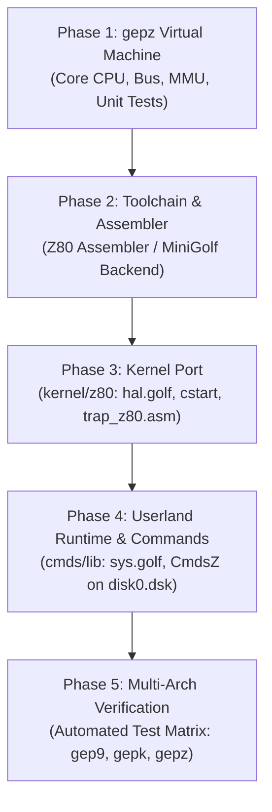

# Hatvan OS/Z & Hatvan VM/Z Specification

**Architecture Specification for Hatvan Z80 Virtual Machine (`gepz`) and Physical Hardware Target**

---

## 1. Overview & Vision

**Hatvan OS/Z** (`hatvan-osz`) extends Hatvan OS to the **Zilog Z80** 8-bit microprocessor architecture. Following the design established for the Hitachi 6309 / Motorola 6809 (`gep9`) and Motorola 68000 (`gepk`), Hatvan OS/Z brings clean process isolation, Unix-like process hierarchy, and OS-9 API semantics to the ubiquitous Z80 ecosystem. (*"gép" means machine in Hungarian; architecture code `'z'` joins `'9'` and `'k'`.*)

This specification defines the system from two complementary perspectives:
1. **The Software Virtual Machine (`gepz`)**: A clean-room, dependency-free emulator written in Go. It implements a complete Z80 CPU model, 256 isolated 64 KB task address spaces, the standard Hatvan `$FFxx` memory-mapped I/O page, port-based trap dispatch, and symbolic execution tracing.
2. **The Discrete Hardware Target**: A physical system architecture pairing a vintage or modern CMOS Z80 CPU (e.g., Z84C0020) with a CPLD/FPGA memory management unit (MMU), static RAM, and hardware UART/timer peripherals.

---

## 2. Z80 CPU Architecture & Execution Model

The system is centered around the Zilog Z80 processor clocked at standard frequencies (4 MHz to 20 MHz):

* **Data Bus**: 8-bit bidirectional data bus (`D0..D7`).
* **Address Bus**: 16-bit address bus (`A0..A15`), addressing a 64 KB logical memory space per task.
* **Bus Control Lines**:
  * `$\overline{\text{M1}}$`: Machine Cycle 1 (active low during opcode fetches and interrupt acknowledge cycles).
  * `$\overline{\text{MREQ}}$`: Memory Request (active low when the address bus holds a valid memory address).
  * `$\overline{\text{IORQ}}$`: I/O Request (active low during input/output cycles and interrupt acknowledge).
  * `$\overline{\text{RD}}$` / `$\overline{\text{WR}}$`: Memory and I/O read/write strobes.
  * `$\overline{\text{NMI}}$`: Non-Maskable Interrupt (negative edge-triggered, vectors to `$0066\text{h}$`).
  * `$\overline{\text{INT}}$`: Maskable Interrupt (level-sensitive, acknowledged via `IM 1` vector `$0038\text{h}$`).
* **Register Architecture**:
  * **Main Register Set**: Accumulator `A`, Flags `F`, and general register pairs `BC`, `DE`, `HL`.
  * **Alternate Register Set**: `A'`, `F'`, `BC'`, `DE'`, `HL'` (swapped via `EX AF, AF'` and `EXX`).
  * **Index Registers**: `IX` (16-bit) and `IY` (16-bit) for base+displacement addressing.
  * **Stack Pointer**: `SP` (16-bit).
  * **Program Counter**: `PC` (16-bit).
  * **Interrupt Control**: Interrupt Page Base `I`, Memory Refresh `R`, and flip-flops $IFF_1$ and $IFF_2$.

### The Single Stack Pointer Architectural Characteristic

Unlike the 6809 (which provides both Hardware Stack `S` and User Stack `U`) or the 68000 (which provides `SSP` and `USP`), **the Z80 contains only one hardware Stack Pointer (`SP`)**. 

When a trap or interrupt occurs while running a user task:
* The Z80 pushes return information directly to the active `SP` (in the user's task space).
* When entering the kernel, `SP` still points to the user stack until firmware explicitly loads a kernel stack pointer.
* Returning to user space requires restoring the user `SP` before or during task transition.

This architectural trait directly governs the design of Hatvan OS/Z's trap stubs and MMU task-switching fuses (detailed in Section 5).

---

## 3. Tasks and Memory Organization

Hatvan OS/Z organizes physical memory into **256 independent task spaces** (`Task 0` through `Task 255`), managed by the Hatvan MMU:

```
        Task 0 (Supervisor / Kernel)               Tasks 1..255 (User Mode)
+----------------------------------------+ +----------------------------------------+
| $FFFF                                  | | $FFFF                                  |
|   Memory-Mapped I/O ($FF00..$FFFF)     | |   PROTECTED (Fatal Hardware Trap)      |
| $FF00                                  | | $FF00                                  |
+----------------------------------------+ +----------------------------------------+
| $FEFF                                  | | $FEFF                                  |
|   Shared Memory Curtain ($E000..$FEFF) | |   User RAM (Code, Data, Stack)         |
|   (Shared by Tasks 0, 1, and 2)        | |   Stack (SP) grows downwards           |
| $E000                                  | |   Heap / Data grows upwards            |
+----------------------------------------+ |                                        |
| $DFFF                                  | |                                        |
|   Kernel RAM / Buffers / Text          | |                                        |
| $0100                                  | | $0100                                  |
+----------------------------------------+ +----------------------------------------+
| $00FF                                  | | $00FF                                  |
|   Z80 Hardware Vectors ($0000..$00FF)  | |   User Zero-Page / Scratch             |
|   $0000: Reset / Boot Entry            | |                                        |
|   $0038: Maskable IRQ (IM 1 Timer)     | |                                        |
|   $0066: NMI Syscall Trap Handler      | |                                        |
| $0000                                  | | $0000                                  |
+----------------------------------------+ +----------------------------------------+
```

### 3.1 Task 0: Supervisor / Kernel Space

* **Vector Page (`$0000..$00FF`)**:
  * `$0000`: Reset Vector. System boots into Task 0 with interrupts disabled.
  * `$0038`: Maskable Interrupt Handler (Interrupt Mode 1). Receives 60 Hz timer ticks (`Ctrl.TimrIRQ`) and keyboard character arrival (`Ctrl.TermIRQ`).
  * `$0066`: Non-Maskable Interrupt (NMI) Handler. Serves as the primary system call trap dispatcher for user space requests.
  * `$0008, $0010, $0018, $0020, $0028, $0030`: Restart instructions (`RST 08h`..`RST 30h`), reserved for fast kernel runtime primitives (e.g., panic, DMA copy dispatch, or math helpers).
* **Kernel Memory (`$0100..$DFFF`)**: Contiguous static RAM holding kernel code, global variables, task descriptors, and private kernel stack.
* **Shared Memory Curtain (`$E000..$FEFF`)**:
  * Shared across **Task 0 (Kernel)**, **Task 1 (RBF Disk Driver)**, and **Task 2 (PROCFS Driver)**.
  * Hosts the `SharedTables` structure: `ProcTable[16]`, `PathTable[16]`, `RBFMailbox[64]`, and `ProcfsMailbox[64]`.
  * Eliminates DMA overhead for inter-driver communication.
* **Memory-Mapped I/O Page (`$FF00..$FFFF`)**: Dedicated to Hatvan hardware registers.

### 3.2 Tasks 1..255: User Spaces

* Each user process runs in a dedicated Task Number matching its Process ID (PID).
* Memory `$0000..$FEFF` is private to each user process.
* **Strict Page Protection**: Any memory read, write, or opcode fetch to `$FF00..$FFFF` while in a user task ($N \ge 1$, unless blessed by `TaskFlags`) triggers an immediate fatal hardware trap, terminating the process with a core dump.

---

## 4. Hardware Devices & I/O Ports

Hatvan OS/Z preserves the established Hatvan hardware memory-mapped register interface in Page `$FF` while introducing a dedicated I/O port for syscall traps.

### 4.1 Memory-Mapped I/O Registers (`$FF00..$FFFF` in Task 0)

All multi-byte addresses and counts within the `$FFxx` page are big-endian to match existing Hatvan conventions:

| Address | Register Name | R/W | Description |
| :--- | :--- | :---: | :--- |
| **`$FF00`** | `putchar` (`Term.Out`) | W | Write ASCII byte to standard console output. |
| **`$FF01`** | `getchar` (`Term.In`) | R | Read ASCII byte from console keyboard (non-blocking; returns `0` if empty). |
| **`$FF02`** | `Reg.Stat` | R/W | Status Register. Bit 0 = `Timer.Ready` (write 1 to clear). Bit 1 = `Term.RxReady` (write 1 to clear). |
| **`$FF03`** | `Reg.Ctrl` | R/W | Control Register. Bit 0 = `Ctrl.TimrIRQ` (1 = enable 60Hz IRQ). Bit 1 = `Ctrl.TermIRQ` (1 = enable console IRQ). |
| **`$FF04`** | `logchar` | W | Write ASCII byte to kernel debug log (`os.Stderr`). |
| **`$FF05`** | `ExitCode` | R/W | Writing halts the virtual machine and exits with the written status code. |
| **`$FF10`** | `Disk.Drive` | R/W | Disk drive selector (`0`..`3`, corresponding to `/d0`..`/d3`). |
| **`$FF11..$FF13`** | `Disk.Sector` | R/W | 24-bit Logical Sector Number (LSN), big-endian. |
| **`$FF14`** | `Disk.Task` | R/W | Target memory Task ID for disk sector transfer. |
| **`$FF15..$FF16`** | `Disk.Addr` | R/W | 16-bit target buffer address in destination task. |
| **`$FF17`** | `Disk.CmdStat` | R/W | Write: `1 = Read`, `2 = Write`. Read: `0 = Busy`, `1 = OKAY`, `>1 = Error`. |
| **`$FF20`** | `TaskFuse` | W | Latches target user task number for returning from kernel mode. |
| **`$FF21`** | `Dma.SrcTask` | R/W | Source task ID for cross-task block transfer. |
| **`$FF22..$FF23`** | `Dma.SrcAddr` | R/W | 16-bit source memory address. |
| **`$FF24`** | `Dma.DstTask` | R/W | Destination task ID. |
| **`$FF25..$FF26`** | `Dma.DstAddr` | R/W | 16-bit destination memory address. |
| **`$FF27`** | `Dma.CountStat` | R/W | Write: byte count (`1..255`, or `0 = 256 bytes`). Initiates copy. Read: `0 = Busy`, `1 = OKAY`. |
| **`$FF2D`** | `TaskFlagsTarget`| W | Selects target task ID for capability flag configuration. |
| **`$FF2E`** | `TaskFlags` | R/W | Bit 0 = `I/O Privilege` (allows Tasks 1 & 2 to access `$FF00..$FFFF` directly). |
| **`$FF2F`** | `PurgeTaskMem` | W | Zeroes/frees the specified task's 64 KB memory space and revokes privileges. |

### 4.2 Dedicated Hardware I/O Ports

In addition to memory-mapped I/O, the Z80 features a distinct I/O port address space accessed via `IN` and `OUT` instructions:

* **Port `60h` (`0x60`) — Syscall Trap Port**:
  * An `OUT (60h), A` instruction executed from user space generates an I/O write cycle with address lines $A_0..A_7 = \text{60h}$.
  * External hardware / MMU decodes this cycle, latches the trap state, and immediately asserts the `$\overline{\text{NMI}}$` line to the CPU.
  * Optionally, the value in register `A` during the `OUT` instruction is captured by an MMU latch at `$FF60`, allowing zero-overhead transfer of the syscall opcode or parameters.

---

## 5. Trap Mechanics, System Call ABI & Task Switches

### 5.1 The 6809 $\leftrightarrow$ Z80 Register Correspondence

In Hatvan OS, the kernel system call interface is standardized around the OS-9 calling conventions. To ensure identical semantics across 6809, 68000, and Z80, we define a natural, direct mapping between 6809 registers and Z80 registers:

| 6809 Register | OS-9 Syscall Role | M68000 Equivalent | **Proposed Z80 Register** | Z80 Architectural Justification |
| :---: | :--- | :---: | :---: | :--- |
| **`A`** (8-bit) | Primary byte operand (Path ID, Open mode, ChgDir mode) | `D1.B` | **`A`** (Accumulator) | Direct 1:1 match in size and semantics. |
| **`B`** (8-bit) | Error code on return; auxiliary attrs/status | `D0.B` | **`B`** | Standard 8-bit secondary register; holds error code when Carry is set. |
| **`X`** (16-bit) | Buffer pointer, pathname string address | `A0` | **`HL`** | Primary 16-bit memory pointer in Z80 architecture; fastest dereferencing `(HL)`. |
| **`Y`** (16-bit) | Byte count, transfer length, buffer size | `D2` | **`BC`** | Natural Z80 hardware counter register (used by `LDIR`, `CPIR`). |
| **`U`** (16-bit) | Parameter block pointer, auxiliary args | `A1` | **`IX`** | Base pointer for indexed struct addressing `(IX+d)`, ideal for parameter blocks. |
| **`CC.C`** | Carry Flag (0 = Success, 1 = Error) | `CCR[C]` | **`F.C`** (Carry Flag) | Direct 1:1 match. Handled via `JR C, error_handler` (analogous to `BCS`). |
| **Syscall ID**| Inline byte after `SWI2` (`fcb call_num`) | `D0.L` | **`DEFB call_num`** or **Register `A`** | Inline byte follows `OUT (60h), A` (see Section 5.3). |

#### Syscall Register Mapping in `SyscallFrame`

In the kernel's MiniGolf syscall layer ([`kernel/common/syscall.golf`](file:///home/strick/github.com/strickyak/hatvan-os/kernel/common/syscall.golf)), `UserFrame` is populated on trap entry as follows:

```go
type SyscallFrame struct {
    CC byte // Maps to Z80 Flags (F), specifically Carry (bit 0)
    A  byte // Maps to Z80 A (Path ID / mode)
    B  byte // Maps to Z80 B (Error code / status)
    DP byte // Unused on Z80 (set to 0)
    X  word // Maps to Z80 HL (Buffer / Path pointer)
    Y  word // Maps to Z80 BC (Length / Count)
    U  word // Maps to Z80 IX (Parameter block pointer)
    PC word // Maps to Z80 return PC
}
```

### 5.2 Trap Entry Sequence (User $\to$ Kernel)

When a user task issues a system call, the hardware and software cooperate through the following sequence:

```
+-----------------------------------------------------------------------------------+
| 1. User Task executes:                                                            |
|       OUT (60h), A        ; Trigger trap                                          |
|       DEFB CALL_NUM       ; Inline syscall code (e.g. 0x84 = I$Open)              |
+-----------------------------------------+-----------------------------------------+
                                          |
                                          v
+-----------------------------------------------------------------------------------+
| 2. Hardware / MMU:                                                                |
|    * Port 60h write detected -> Asserts NMI line low.                             |
|    * Z80 pushes 16-bit PC (pointing to DEFB CALL_NUM) onto user stack in Task N.  |
|    * Z80 vectors to $0066.                                                        |
|    * MMU detects M1 opcode fetch at $0066 -> Latches CurrentTask = 0 (Kernel).    |
+-----------------------------------------+-----------------------------------------+
                                          |
                                          v
+-----------------------------------------------------------------------------------+
| 3. Kernel NMI Handler ($0066 in Task 0):                                          |
|    * Saves user SP into user_sp_table[CurrentPID].                                |
|    * Switches SP to kernel private stack.                                         |
|    * Saves user registers (AF, BC, DE, HL, IX, IY) into kernel UserFrame.         |
|    * Reads inline CALL_NUM from user memory at user PC via DMA.                   |
|    * Increments user PC past CALL_NUM and updates saved return address.            |
|    * Dispatches call via f_syscall__Dispatch(callNum).                            |
+-----------------------------------------------------------------------------------+
```

### 5.3 Returning From Interrupt Into a Specific Task: Is It a Problem?

**No. Returning from an interrupt into a specific task on the Z80 is fully solvable and fits naturally into Hatvan OS's TaskFuse architecture.**

#### The Challenge

On the 6809, `RTI` pulls all 12 registers from the stack, allowing a simple fuse armed before `RTI` to switch memory spaces while registers are pulled. On the Z80:
1. `RETN` (opcode `ED 45`) **only pops the 16-bit Program Counter** from `(SP)`. All other registers must be loaded into CPU registers while still in the kernel.
2. The Z80 has only **one Stack Pointer (`SP`)**. If `SP` is pointed at user memory before leaving Task 0, any interrupt or stack operation could corrupt memory if not carefully sequenced.

#### The Hatvan OS/Z Solution: The `RETN` TaskFuse

Hatvan OS/Z resolves this cleanly by defining the **`RETN` TaskFuse**:

1. **Register Restoration in Kernel Space**:
   The kernel restores all general user registers (`IY`, `IX`, `HL`, `DE`, `BC`, `AF`) directly from the kernel's saved context table while still executing in Task 0:
   ```z80
   LD   IY, (saved_user_iy)
   LD   IX, (saved_user_ix)
   LD   HL, (saved_user_hl)
   LD   DE, (saved_user_de)
   LD   BC, (saved_user_bc)
   ```
2. **User Stack Pointer Restoration**:
   The kernel loads `SP` with the user's saved stack pointer:
   ```z80
   LD   SP, (saved_user_sp)
   ```
   *(Note: The user's stack at `(SP)` already contains the updated 16-bit return address.)*

3. **Arming the TaskFuse**:
   The kernel writes the target task ID to `$FF20`:
   ```z80
   LD   A, (target_task_id)
   LD   (0xFF20), A          ; Arm TaskFuse
   ```
4. **Restoring `AF` and Executing `RETN`**:
   ```z80
   POP  AF                    ; If AF was preserved on stack, or load via EX AF,AF'
   RETN                       ; Opcode ED 45
   ```

#### MMU Bus Cycle Decoding for `RETN`

The MMU monitors the Z80 bus for the `RETN` instruction (`ED 45`):
* **Opcode Fetch 1 (`ED`)**: Fetched from Task 0.
* **Opcode Fetch 2 (`45`)**: Fetched from Task 0.
* **Hardware Task Switch Trigger**:
  Upon recognizing the complete `ED 45` opcode while `TaskFuse` is armed:
  * The MMU switches `CurrentTask = TaskFuseTarget` **during the subsequent memory read cycles**.
  * The two stack pop read cycles (`(SP)` and `(SP+1)`) are fetched directly from the **user task's memory space**.
  * `SP` is incremented by 2.
  * The CPU automatically copies $IFF_2 \to IFF_1$, restoring user interrupt status.
  * The subsequent instruction fetch cycle ($\overline{\text{M1}}=0$) occurs at the user's return `PC` inside the user task space!

> [!NOTE]
> Snooping `ED 4D` (`RETI`) and `ED 45` (`RETN`) on the bus is standard industry practice for Z80 systems; standard Z80 peripheral chips (Z80-PIO, Z80-CTC, Z80-SIO) use identical bus-snooping logic to manage interrupt daisy chains.

---

## 6. The `gepz` Virtual Machine Architecture

The `gepz` emulator is organized within the Hatvan repository following the structure of `gep9` and `gepk`:

```
hatvan-os/
├── cmd/
│   └── gepz/
│       └── main.go          # Command-line entry point (flags, I/O wiring, run loop)
└── gepz/
    ├── cpu.go               # Z80 CPU state, step loop, registers, flags, NMI/IRQ
    ├── ops_main.go          # Base opcode dispatch (0x00..0xFF)
    ├── ops_cb.go            # Bit manipulation instructions (0xCB prefix)
    ├── ops_ed.go            # Extended instructions (0xED prefix: RETN, LDIR, etc.)
    ├── ops_dd_fd.go         # Index register instructions (IX: 0xDD, IY: 0xFD)
    ├── alu.go               # Flag calculation (S, Z, H, P/V, N, C) and arithmetic
    ├── bus.go               # 256 Task memories, $FFxx I/O, TaskFuse, DMA copy
    ├── ports.go             # I/O Port dispatch (Port 60h trap handler)
    ├── disasm.go            # Instruction disassembler for tracing
    └── data/
        └── os9api.go        # Symbolic syscall decoder for trace logs
```

### 6.1 CPU & Bus Implementation Details

```go
type CPU struct {
    // Main Registers
    A, F    byte
    B, C    byte
    D, E    byte
    H, L    byte

    // Alternate Registers
    A_, F_  byte
    B_, C_  byte
    D_, E_  byte
    H_, L_  byte

    // Index & Pointer Registers
    IX, IY  uint16
    SP, PC  uint16

    // Interrupt Registers & State
    I       byte
    R       byte
    IFF1    bool // Active interrupt enable
    IFF2    bool // NMI temporary storage for IFF1
    IM      byte // Interrupt Mode (0, 1, 2)

    Bus     *Bus
    Halted  bool
    Cycles  uint64
}

type Bus struct {
    Memory              [256][65536]byte // 256 isolated 64 KB task spaces
    CurrentTask         uint8
    TaskFuseArmed       bool
    TaskFuseTarget      uint8
    SharedMemoryCurtain uint16           // Default: 0xE000 for Tasks 0, 1, 2
    TaskFlags           [256]byte
    // Hardware I/O registers ($FF00..$FFFF)
    // ...
}
```

### 6.2 Port 60h Trap Dispatch in `Bus`

```go
func (b *Bus) WritePort(port uint16, val byte) {
    port8 := byte(port & 0xFF)
    switch port8 {
    case 0x60: // Syscall Trap Port
        b.TrapPending = true
        b.LatchedTrapVal = val
    }
}
```

In the CPU step loop, if `b.TrapPending` is true at instruction boundary, the CPU executes the NMI sequence: pushes `PC`, clears `IFF1`, sets `PC = 0x0066`, and switches `CurrentTask = 0`.

---

## 7. Binary Formats & Architecture Identification

### 7.1 Extended DECB Format (`.decb`)
Hatvan OS/Z standardizes on the segmented Extended DECB format for executable binaries:
* Fixed 5-byte chunk header format:
  ```
  [Tag: uint8] [Length: uint16 BE] [Address/Arg: uint16 BE] [Payload: Length bytes]
  ```
* **Data Chunks (`Tag = 0x00`)**: Loads `Length` bytes into memory at `Address`.
* **Execution Postamble (`Tag = 0xFF`)**: `Length` is 0; `Address` is execution start address (`entryPC`).

### 7.2 Architecture Magic Marker (`Tag = 0xFD` / 253)
To prevent cross-architecture execution errors and guarantee binary integrity, all Hatvan executables begin with a 5-byte magic tag:
```
[Tag: 253 ($FD)] [Length: 0 ($0000)] [Address: Byte 0 = $78 ('x'), Byte 1 = 'z']
```
* **Tag**: `0xFD` (253).
* **Length**: `0x0000` (payload length is 0 and ignored).
* **Address Slot**:
  * Byte 0: `0x78` (`'x'`), denoting an executable file.
  * Byte 1: Architecture identification byte:
    * `'9'`: Motorola 6809 / Hitachi 6309
    * `'k'`: Motorola 68000
    * `'z'`: Zilog Z80
* **Kernel Enforcement**:
  * In `LoadBinary` / `SysFork`, Hatvan OS validates that the magic tag is present and matches `hal.ARCH` (`'z'` on Z80).
  * Untagged DECB files or binaries targeted for other architectures are rejected with `E_FORMAT` (error 213).

---

## 8. Implementation Roadmap & Milestones

The integration of the Z80 architecture into Hatvan OS proceeds across five structured phases:



### Phase 1: `gepz` Virtual Machine Core
1. Implement the Z80 CPU execution engine in `gepz/` with complete opcode decoding (`Main`, `CB`, `ED`, `DD`, `FD`).
2. Implement 256-task memory bus with `$FFxx` memory-mapped I/O, `TaskFuse`, `DMACopy`, and Shared Memory Curtain (`$E000`).
3. Add port `0x60` trap latch triggering NMI and task switch to Task 0.
4. Verify instruction execution against standard Z80 validation suites (e.g. Frank Cringle's Z80 instruction exerciser / ZEXALL).

### Phase 2: Toolchain & Assembler Support
1. Integrate Z80 assembly support into the build pipeline (either via an embedded assembler like `z80asm`/`pasmo` or extending `minigolf -m=z` with a native Z80 code generator).
2. Create `build/asmz80` or toolchain scripts matching `build/asm6809` and `build/asm68k`.

### Phase 3: Hatvan Kernel Port (`kernel/z80/`)
1. Implement `kernel/z80/cstart_z80.asm`: initial stack, zero page vector setup, jump to `_main`.
2. Implement `kernel/z80/trap_z80.asm`:
   * Vector `$0066` NMI trap handler.
   * Extraction of user registers into `v_syscall.UserFrame`.
   * DMA copy of inline syscall opcode byte.
   * Dispatch to `f_syscall__Dispatch`.
   * `RETN` TaskFuse return sequence.
3. Implement `kernel/z80/hal.golf`: CPU-specific HAL functions (`Halt`, `EnableInterrupts`, `DisableInterrupts`).
4. Build `build/kernel_z80.bin` (or `.hex`).

### Phase 4: Userland Runtime & Core Commands (`CmdsZ`)
1. Implement `cmds/lib/cstart_z80.asm`: user process entry point, command argument pointer setup, exit stub.
2. Implement userland syscall wrappers in `cmds/lib/sys.golf` using `OUT (60h), A; DEFB call_num`.
3. Compile core commands (`GECHO`, `GCAT`, `GDIR`, `GDUMP`, `GSH2`, `TEST`, `EXPR`) for Z80.
4. Populate OS-9 disk image with `CmdsZ` directory alongside `Cmds9` and `CmdsK`.

### Phase 5: Verification & Unified Testing
1. Add `make test-z80` to root `Makefile`.
2. Verify parity across all three architectures:
   * Boot self-tests (`PATH:TERM:OK`, `PATH:DUPDEV:OK`).
   * RBF disk I/O and PROCFS operations.
   * Full execution of `triangle.sh`, `test_expr.sh`, and `test_while.sh` under `GSH2` on `gepz`.
